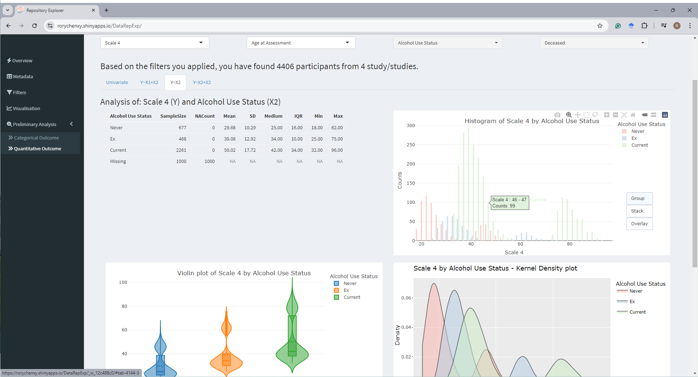

# Summary
The Data Repository Explorer, DataRepExp, is an open-source R Shiny application developed to improve the findability, accessibility, interoperability, and reusability (FAIR) [@FAIR] of research data held in a data repository.
The application displays standardised metadata across multiple studies including data availability by categories (such as demographics, medical history, imaging data and genomic data) to allow high-level comparison.
It enables users to explore and run preliminary analysis from participants that match certain criteria.
In addition, it provides features to export reports and aggregated results for data access application purposes.
The application was initially developed for a discipline-specific data-sharing platform, the Dementias Platform Australia (DPAU) [@DPAU].
Envisioning this work could be utilized by other data repositories in diverse disciplines, this demo application was created using simulated health-related data for demonstration purposes.

-   Source Code: <https://github.com/RoryChenXY/DataRepExp_public>
-   Web Application: <https://rorychenxy.shinyapps.io/DataRepExp/>
-   Contact: [xinyue.chen1\@unsw.edu.au](mailto:%20xinyue.chen1@unsw.edu.au)

# Statement of Need
Data repositories have become increasingly important in recent years as more emphasis has been placed on open science practices and data sharing.
By making data publicly available through repositories, researchers can ensure data persistence and support data preservation, as well as facilitate the reuse of their data, thereby increasing the potential for new scientific discoveries.

However, challenges exist for data findability, accessibility, interoperability, and reusability (FAIR) [@FAIR].
Even though most data repositories have adopted various metadata schemas to describe the dataset [@Contaxis2022], it is increasingly a challenge for researchers to find relevant data that meet research interests or needs [@Gregory2018].
For multi-study research, applying to access different datasets usually comes with diverse and complicated data-sharing requirements and workflows, extensive administrative workloads and waiting periods.
Upon approval, substantial efforts of data harmonization are usually required due to inconsistent data structures and labeling conventions, and harmonised dataset are hardly reused.
We found that many data repositories do not provide comprehensive metadata, nor centralised tables for comparison.
With repositories that provide data visualisation, Power BI and Tableau are commonly used but costs are incurred. 
R-shiny could provide more flexibility and functions at a fraction of the cost.

Designed to enable easier access to research data held in data repositories, DPAU [@DPAU] seeks to address these challenges with R-Shiny [@R-shiny].
The application designed for DPAU includes rich metadata and a set of commonly used variables [@bauermeister2023evaluating], identified as being of broad interest to dementia research, harmonised using the C-Surv data model [@bauermeister2023ready], which has been developed by Dementias Platform UK (DPUK) [@bauermeister2020dementias], and adopted by Alzheimer’s Disease Data Initiative (ADDI) [@ADDI] and DPAU [@DPAU].
Researchers can identify data points from participants that match certain criteria, using filters at study and/or participant levels, then explore and conduct preliminary analysis on the filtered dataset.
The application also allows users to export reports and aggregated results.
The exported reports can then be used when submitting a single centralised data access application form for accessing data from multiple studies through the DPAU Data Portal [@DPAUportal].

DataRepExp was created with simulated data and a list of generalized health-related variables.
This work can be modified and utilized by other data repositories by adopting the discipline-specific metadata schema and common variables. 
Considering some repositories may hold highly sensitive data, or individual-level data may not be not available, a metadata-only version DataRepExp has also been developed, and relevant code is included in the GitHub Repository.

With rich metadata for findability, the interactive visualization dashboard for accessibility, standardization and harmonization for data interoperability and reusability, this tool can improve the FAIR[@FAIR] of research data held in a data repository.
R programming skill is required for reproducibility, detailed documentation and syntax is open-source and publicly available.

# Methods

DataRepExp was written using R [@R-Base] and JavaScript using the following packages:

-   Shiny: shiny [@R-shiny], shinydashboard [@R-shinydashboard], shinyWidgets [@R-shinyWidgets], shinyjs [@R-shinyjs].
-   Data manipulation: dplyr [@R-dplyr], tidyr [@R-tidyr], tidyverse [@R-tidyverse], forcats [@R-forcats], useful [@R-useful], magrittr [@R-magrittr], purrr [@R-purrr].
-   Data Report and Visualisation: ggplot2 [@R-ggplot2], plotly [@R-plotly], scales [@R-scales], DT [@R-DT], htmltools [@R-htmltools], fontawesome [@R-fontawesome].

## Deployment

The Data Repository Explorer, DataRepExp, is hosted through easy-to-use [shinyapps.io](https://www.shinyapps.io/),  while the DPAU version is hosted on AWS environment using Shiny Server for high availability, scalability, security, and compliance.

# Overview

The application layout features a side menu, through which the users can navigate through tabs, and the main view which displays the content of the selected tab.

-   First tab -- Overview: includes statement and navigation instructions.
-   Second tab -- Summary Tables: three metadata tables for high-level comparison
-   Third tab -- Filters and Filter Reports: users can adjust and apply filters to identify participants and studies that match selected criteria. They can download the Filter Report with the list of studies that matches the filters selected.
-   Fourth tab -- Visualisation: plots are organised by different domains, generated using the filtered dataset.
-   Fifth tab -- Preliminary Analysis: Preliminary Analysis: preliminary analysis can be done with user-selected variables.

Application features include: 

- Simulation: For demonstration purposes, we generated simulated data.
Scripts and reference documents used to generate the data can be found in the GitHub repository.
- Modularisation: DataRepExp was built in Shiny modules. Modularity makes the app easy to test, maintain, and deploy.
The features can be easily further expanded with loose coupling module design.
- Interactive: DataRepExp provides an interactive interface that allows users to engage with the data and output.
Elevated user experience with integrative charts and figures, which include functions such as sort, filter, zoom, select, adjust axis, hover for information, reset, etc.

# Acknowledgement

This application was inspired by the visualisation tool developed by DPUK [@bauermeister2020dementias] using PowerBI, then developed in R [@R-Base] for the DPAU [@DPAU]. We acknowledge the generous sharing of best practices and knowledge from DPUK.

# Declaration of Co-authorship

SB, JB, ES, ST and JG established DPUK [@bauermeister2020dementias], conceived DPUK’s Cohort Explorer, and developed the C-Surv [@bauermeister2023ready] standard data model optimised for data discovery for use with research cohort data. These DPUK tools inspired RC’s conception of the presented R-Shiny Data Repository Explorer, with input from all authors along the development process. RC developed the script. AV conducted the code review for the scripts. JCSJ provided input into the draft script and notes. VSC provided input into the user interface and presentation layout. RC led the manuscript writing. PSS obtained research funding for the DPAU team. All authors provided feedback and approved the final manuscript. 

# Funding

This work is supported by grants from the National Institute on Aging/ National Institute of Health (NIA/NIH) [1RF1AG057531-01] and the Medical Research Council [MRC/T0333771]. 

# Availability and Community Guidelines

The application and source code are available at the [GitHub repository](https://github.com/RoryChenXY/DataRepExp_public).
Users and contributors are welcome to contribute, request features, and report bugs through the GitHub repository.

# References
